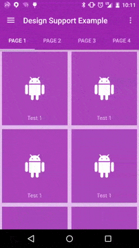
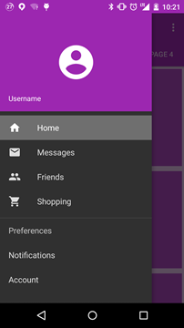
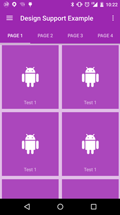

# Design Support Example
Example project using the Android Design Support Library. This demo should work all the way back to Android 2.3.3. 

&nbsp;&nbsp;&nbsp;&nbsp;

# Support Libraries
- appcompat-v7 (22.2.0)
- design (22.2.0)
- recyclerview-v7 (22.2.0)

# Features
- DrawerLayout
- CoordinatorLayout
- ViewPager
- NavigationView
- SwipeRefreshLayout
- RecyclerView
- Activity animation (5.0+ devices)
